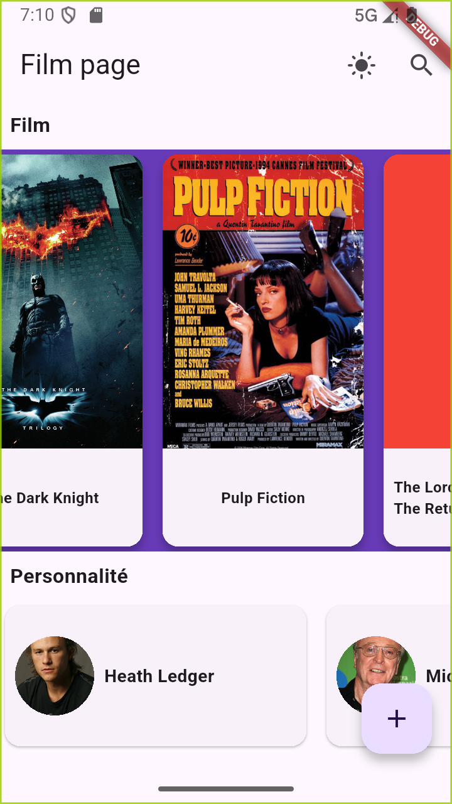

# 🎬 Multi Screen App — Catalogue de Films & Personnalités

Application Flutter multi-écrans permettant de parcourir un catalogue de films et de personnalités (acteurs, réalisateurs), avec navigation par `go_router`, recherche instantanée, formulaire d'ajout, thème clair/sombre persistant et design responsive (mobile / tablette / desktop).

## 📸 Aperçu

### Page d'accueil
Catalogue de films (carrousel horizontal) et personnalités, avec bouton d'ajout flottant et bascule de thème dans l'AppBar.



---

### Détail d'un film
Affiche plein écran, titre, date de sortie, synopsis scrollable et liste des personnalités associées au casting.


---

### Recherche instantanée
Le `SearchDelegate` affiche en temps réel les films et personnalités correspondants, avec un lien « Tout afficher » pour chaque catégorie.


---

### Résultats complets — Films
Vue dédiée affichant tous les films correspondant à la recherche, avec genre affiché sous chaque titre.

.png)

---

### Résultats complets — Personnalités
Vue dédiée listant toutes les personnalités (acteurs, réalisateurs) correspondant à la recherche.

.png)

---

### Fiche personnalité
Photo de profil, date de naissance, genre et filmographie de la personnalité sélectionnée.


---

### Formulaire d'ajout de film
Saisie du titre, synopsis, genre (menu déroulant), année de sortie et poster, avec bouton de validation.


## ✨ Fonctionnalités

- **Catalogue de films et de personnalités** chargé depuis des fichiers JSON locaux (`assets/data/`)
- **Navigation multi-écrans** avec `go_router` (Navigator 2.0) : accueil, détail film, détail personnalité, formulaire, résultats de recherche
- **Recherche instantanée** (films et personnalités) via `SearchDelegate`, avec suggestions en direct et vue "tout afficher"
- **Formulaire d'ajout de film** avec validation de champs (titre, synopsis, genre, année, poster)
- **Thème clair / sombre** basculable depuis l'AppBar, préférence sauvegardée localement et rechargée au démarrage
- **Design responsive** : tailles de cartes et de listes adaptées au mobile, à la tablette et au desktop
- **Affichage des images** en réseau avec cache, placeholder de chargement et gestion d'erreur (`cached_network_image`)
- **Widgets réutilisables** centralisés dans `lib/shared/widgets/`

## 🏗️ Architecture

Le projet suit une architecture **feature-first**, chaque fonctionnalité étant organisée en couches `domain` / `application` / `presentation` :

```
lib/
├── main.dart                     # Point d'entrée, configuration du thème et du MaterialApp.router
├── routing/
│   └── routes.dart                # Déclaration des routes go_router
├── features/
│   ├── film/
│   │   ├── domain/                # Modèle Film
│   │   ├── application/           # FilmService (lecture/écriture JSON, recherche par id)
│   │   └── presentation/
│   │       ├── screens/           # SpecificFilmPage, FilmForm
│   │       └── widget/            # CardFilmWidget, SearchCardFilm
│   ├── person/
│   │   ├── domain/                # Modèle Person
│   │   ├── application/           # PersonService
│   │   └── presentation/
│   │       ├── screens/           # SpecificPerson
│   │       └── widgets/           # CardPersonWidget, SearchCardPerson
│   └── credits/
│       ├── domain/                # Modèle Credits (lien film ↔ personnalité)
│       └── application/           # CreditsService
└── shared/
    ├── screens/                   # Homepage, ResultSearchFilm, ResultSearchPerson
    ├── widgets/                   # SearchResultSection (widget réutilisable)
    ├── services/                  # Repository générique, PreferenceService (persistance du thème)
    └── utils/                     # ThemeProvider, Responsive (helpers responsive)
```

## 🚀 Installation et lancement

### Prérequis

- [Flutter SDK](https://docs.flutter.dev/get-started/install) (Dart ^3.10.8)
- Un émulateur Android/iOS, un navigateur (pour le support web) ou un appareil physique connecté

### Étapes

1. **Cloner le dépôt**
   ```bash
   git clone https://github.com/Don-SKRED/Projet-Flutter-App-multi--crans-avec-navigation.git
   cd Projet-Flutter-App-multi--crans-avec-navigation
   ```

2. **Installer les dépendances**
   ```bash
   flutter pub get
   ```

3. **Vérifier les appareils disponibles**
   ```bash
   flutter devices
   ```

4. **Lancer l'application**
   ```bash
   flutter run
   ```
   Ou cible une plateforme précise :
   ```bash
   flutter run -d chrome     # Web
   flutter run -d windows    # Windows
   flutter run -d macos      # macOS
   ```

## 🧪 Lancer les tests

```bash
flutter test
```

Le projet contient :
- des **tests unitaires** pour les modèles `Film` et `Person` (`test/film/`, `test/person/`)
- des **tests du repository** (`test/repository/`)
- des **tests widgets** couvrant le smoke test de l'app, `CardFilmWidget` (rendu et dimensions responsive) et `SearchResultSection` (affichage, limite d'éléments, interaction bouton) (`test/widget/`)

## 📦 Dépendances principales

| Package | Usage |
|---|---|
| `go_router` | Navigation déclarative multi-écrans |
| `cached_network_image` | Affichage et cache des images (posters, photos) |
| `path_provider` | Accès au stockage local pour la persistance des préférences |
| `image_picker` | Sélection d'image pour le formulaire d'ajout |

## 📁 Données

Les données du catalogue sont stockées en local dans `assets/data/` :
- `film_items.json` — liste des films
- `person_items.json` — liste des personnalités
- `credits_items.json` — liens entre films et personnalités (casting)
- `theme_mode.json` — préférence de thème persistée

## 🗺️ Pistes d'amélioration

- Pipeline CI/CD (GitHub Actions) pour lancer `flutter analyze` et `flutter test` automatiquement à chaque push
- Tests widgets supplémentaires sur le formulaire et les écrans de résultats de recherche
- Abstraction des services de données derrière une interface `Repository` commune, avec tests dédiés

## 👤 Auteur

Projet réalisé par [Don-SKRED](https://github.com/Don-SKRED) dans le cadre d'une certification en développement mobile Flutter.