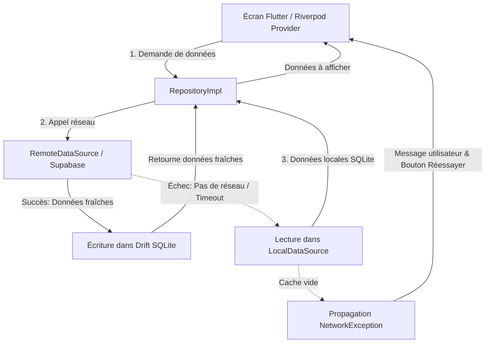

# 🎬 Multi-Screen CineApp — Application Flutter Full-Stack Connectée

[](https://flutter.dev)
[](https://riverpod.dev)
[-green.svg)](https://drift.simonbinder.eu/)
[](https://pub.dev/packages/dio)
[]()

Application mobile Flutter complète connectée à un backend réel (**Supabase**), implémentant une architecture **Feature-First / Clean Architecture**, une gestion d'état réactive avec **Riverpod**, une persistance locale avec **Drift (SQLite)**, un mode hors-ligne avec cache-fallback automatique et une suite complète de tests unitaires sur la couche repository.

---

## 📋 Sommaire

- [Fonctionnalités Obligatoires (Grille d'évaluation)](#-fonctionnalités-obligatoires-grille-dévaluation)
- [Architecture du Projet](#-architecture-du-projet)
- [Gestion des Données et Stratégie Hors-Ligne](#-gestion-des-données-et-stratégie-hors-ligne)
- [Backend et API REST](#-backend-et-api-rest)
- [Gestion d'État et Injection de Dépendances](#-gestion-détat-et-injection-de-dépendances)
- [Sécurité et Authentification](#-sécurité-et-authentification)
- [Lancement des Tests Unitaires](#-lancer-les-tests-unitaires)
- [Installation et Configuration](#-installation-et-lancement)
- [Aperçu de l'Interface](#-aperçu-de-linterface)

---

## ✅ Fonctionnalités Obligatoires (Grille d'évaluation)

| Exigence du Sujet | Implémentation dans l'App | Statut |
| :--- | :--- | :---: |
| **1. Authentification (login / register / logout) — JWT** | Login, Inscription et Déconnexion connectés à l'Auth Supabase. Stockage sécurisé des jetons via `flutter_secure_storage`. Intercepteur Dio injectant automatiquement le `Bearer <token>`. | ✅ Validé |
| **2. Au moins 3 écrans de données issues d'une API REST** | **Écran 1** : Page d'accueil (Catalogue Films et Personnalités).<br>**Écran 2** : Fiche détaillée d'un Film (infos + casting).<br>**Écran 3** : Fiche détaillée d'une Personnalité (bio + filmographie). | ✅ Validé |
| **3. Mise en cache locale des données (SQLite)** | Implémenté avec **Drift ORM (SQLite)** : tables typées (`films_table`, `persons_table`, `credits_table`), batch inserts et requêtes réactives. | ✅ Validé |
| **4. Mode hors-ligne : afficher le cache si pas de réseau** | Pattern **Cache-Fallback** (Network-First avec Fallback SQLite) dans tous les repositories. Détection temps réel avec `connectivity_plus` et bandeau visuel hors-ligne. | ✅ Validé |
| **5. Gestion d'erreurs réseau avec messages utilisateur** | `dio_error_mapper.dart` traduisant les erreurs Dio en exceptions métiers compréhensibles (`NetworkException`, `TimeoutException`, etc.) et affichage dans l'UI avec boutons de réessai. | ✅ Validé |
| **6. Repository pattern & Clean Architecture** | Séparation stricte : `data` (datasources, models, repositories), `domain` (entités, contrats), `presentation` (providers, écrans). | ✅ Validé |
| **7. Au moins 3 tests unitaires sur le repository** | **23 tests unitaires** passés avec succès (`film_repository_test.dart`, `person_repository_test.dart`, `credits_repository_test.dart`). | ✅ Validé |

---

## 🏗️ Architecture du Projet

Le projet suit les principes de la **Clean Architecture** organisée en **Feature-First** :

```
lib/
├── core/                                # Briques transversales de l'application
│   ├── database/                        # Persistance locale Drift (SQLite)
│   │   ├── app_database.dart            # Définition de la BDD Drift
│   │   ├── app_database.g.dart          # Code généré par build_runner
│   │   ├── database_provider.dart       # Provider Riverpod d'AppDatabase
│   │   └── tables/                      # Tables Drift (films, persons, credits)
│   ├── network/                         # Configuration réseau
│   │   ├── dio_client.dart              # Client Dio avec intercepteur JWT
│   │   ├── env.dart                     # Configuration URL / Clés Supabase
│   │   ├── connectivity_provider.dart   # Écoute en direct de la connectivité
│   │   └── error/                       # Exceptions typées et mapper Dio
│   ├── providers/                       # Providers globaux (Dio, SecureStorage)
│   ├── screens/                         # Écrans partagés (Homepage)
│   ├── widgets/                         # Widgets partagés (OfflineBannerWidget)
│   └── utils/                           # Helpers (Responsive, ThemeProvider)
│
├── features/                            # Modules métiers (Feature-First)
│   ├── auth/                            # Module Authentification
│   │   ├── data/                        # AuthDataSource, AuthRepositoryImpl
│   │   ├── domain/                      # AuthRepository (contrat), AuthModel
│   │   └── presentation/                # AuthNotifier, LoginScreen, SignupScreen
│   │
│   ├── film/                            # Module Films
│   │   ├── data/                        # RemoteFilmDataSource, LocalFilmDataSource (Drift)
│   │   │   ├── model/                   # FilmModel (JSON & Drift mapping)
│   │   │   └── repositories/            # FilmRepositoryImpl (stratégie hors-ligne)
│   │   ├── domain/                      # Film (entité), FilmRepository (contrat)
│   │   └── presentation/                # film_provider, SpecificFilmPage, widgets
│   │
│   ├── person/                          # Module Personnalités (Acteurs/Réalisateurs)
│   │   ├── data/                        # RemotePersonDataSource, LocalPersonDataSource
│   │   │   └── repositories/            # PersonRepositoryImpl (stratégie hors-ligne)
│   │   ├── domain/                      # Person (entité), PersonRepository
│   │   └── presentation/                # person_provider, SpecificPerson, widgets
│   │
│   └── credits/                         # Module Crédits (Liaison Film ↔ Personne)
│       ├── data/                        # RemoteCreditsDataSource, LocalCreditsDataSource
│       │   └── repositories/            # CreditsRepositoryImpl
│       ├── domain/                      # Credits (entité), CreditsRepository
│       └── presentation/                # credit_provider
│
└── routing/
    └── routes.dart                      # Configuration déclarative GoRouter avec redirection Auth
```

---

## 💾 Gestion des Données et Stratégie Hors-Ligne

### Schéma de la Stratégie Cache-Fallback (Offline-First)

L'accès aux données dans chaque repository (`FilmRepositoryImpl`, `PersonRepositoryImpl`, `CreditsRepositoryImpl`) respecte le flux suivant :



1. **En ligne** : La donnée fraîche est récupérée via l'API REST Supabase, immédiatement persistée dans la base SQLite locale **Drift** (`app.sqlite`), puis retournée à l'UI.
2. **Hors-ligne** : Dès qu'une perte de réseau est constatée ou qu'un timeout survient, le repository bascule automatiquement sur les données stockées dans SQLite.
3. **Bandeau hors-ligne** : L'état du réseau est écouté en direct via `connectivity_plus`, affichant l'indicateur visuel `OfflineBannerWidget` pour avertir l'utilisateur.
4. **Pull-to-Refresh** : L'utilisateur peut tirer vers le bas (`RefreshIndicator`) pour forcer une ré-interrogation de l'API dès le rétablissement du réseau.

---

## 🌐 Backend et API REST

L'application est connectée à une instance réelle **Supabase** via son API REST :
- `POST /auth/v1/token?grant_type=password` : Connexion utilisateur
- `POST /auth/v1/signup` : Inscription d'un nouvel utilisateur
- `GET /rest/v1/films` : Liste et recherche de films
- `GET /rest/v1/persons` : Liste des acteurs et réalisateurs
- `GET /rest/v1/credits` : Casting et filmographies associées

### Intercepteur Dio (`lib/core/network/dio_client.dart`)
Toutes les requêtes passent par une instance configurée de **Dio** qui :
- Injecte l'`apikey` publique et les en-têtes JSON requis.
- Récupère le jeton JWT dans le `FlutterSecureStorage` et l'injecte dans le header `Authorization: Bearer <token>`.
- Gère les timeouts (`connectTimeout: 10s`, `receiveTimeout: 10s`).

---

## 🔒 Sécurité et Authentification

- **Stockage Sécurisé** : Les tokens d'accès JWT sont chiffrés et stockés via `flutter_secure_storage` (KeyStore sous Android, Keychain sous iOS).
- **Protection des Routes (`GoRouter`)** : La navigation vérifie l'état d'authentification (`authProvider`). Si aucun jeton valide n'est présent, l'utilisateur est automatiquement redirigé vers la page de `/login`.
- **Déconnexion Sécurisée** : L'action de déconnexion nettoie systématiquement le stockage sécurisé dans un bloc `finally` pour garantir qu'aucune donnée de session résiduelle ne persiste.

---

## 🧪 Lancer les Tests Unitaires

Le projet intègre une suite de tests unitaires couvrant la couche Repository conformément au barème de notation.

Pour exécuter tous les tests du repository :

```bash
flutter test test/repository/
```

### Détail des tests validés (23 tests au total) :

1. **`film_repository_test.dart`** :
   - ✅ Retourne les données distantes et les sauvegarde dans la base SQLite locale.
   - ✅ Mode hors-ligne : renvoie les films du cache SQLite lors d'une panne réseau (`DioException`).
   - ✅ Propage une erreur claire si le réseau échoue et que le cache est vide.
   - ✅ Recherche par identifiant (`getFilmById`) avec synchronisation locale.
   - ✅ Recherche par identifiant en mode hors-ligne depuis SQLite.

2. **`person_repository_test.dart`** :
   - ✅ Récupération et persistance locale des personnalités.
   - ✅ Bascule automatique sur le cache en l'absence de réseau.
   - ✅ Traduction des erreurs réseau en `NetworkException` compréhensible.
   - ✅ Recherche unitaire par identifiant avec persistance et fallback hors-ligne.

3. **`credits_repository_test.dart`** :
   - ✅ Synchronisation des crédits (casting et filmographie) vers SQLite.
   - ✅ Restitution du casting en mode hors-ligne depuis la base locale.
   - ✅ Gestion des cas d'erreur sans données en cache.

---

## 🚀 Installation et Lancement

### Prérequis
- [Flutter SDK](https://docs.flutter.dev/get-started/install) (Dart 3.10+)
- Émulateur Android / iOS ou appareil physique connecté

### 1. Cloner le dépôt
```bash
git clone https://github.com/Don-SKRED/Projet-Flutter-App-multi--crans-avec-navigation.git
cd multi_screen_app_with_navigation
```

### 2. Installer les dépendances
```bash
flutter pub get
```

### 3. Génération de code (Drift)
Si vous modifiez les tables de la base de données :
```bash
dart run build_runner build --delete-conflicting-outputs --force-jit
```

### 4. Lancer l'application
```bash
flutter run
```

---

## 📦 Dépendances Principales

| Package | Version | Usage |
|---|---|---|
| `flutter_riverpod` | `^3.3.2` | Gestion de l'état réactive et injection de dépendances |
| `dio` | `^5.11.1` | Client HTTP avec intercepteur d'authentification JWT |
| `drift` | `^2.20.0` | ORM SQLite typé pour la persistance locale |
| `sqlite3_flutter_libs` | `^0.6.0+eol` | Binaires natifs SQLite pour plateformes mobiles |
| `flutter_secure_storage` | `^11.0.0` | Stockage sécurisé et chiffré du token JWT |
| `go_router` | `^17.3.0` | Navigation déclarative avec redirections basées sur l'authentification |
| `connectivity_plus` | `^7.3.1` | Surveillance en temps réel du statut de connectivité réseau |
| `cached_network_image` | `^3.4.1` | Téléchargement et mise en cache disque des affiches et photos |

---

## 👤 Auteur

Projet réalisé par **Don-SKRED** dans le cadre de la validation des compétences Full-Stack Flutter (APIs, Architecture Clean et Persistance locale).